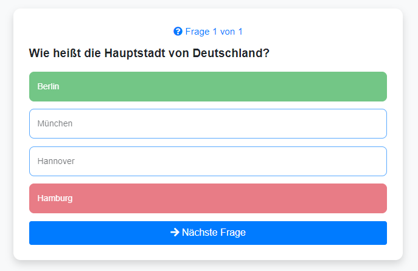
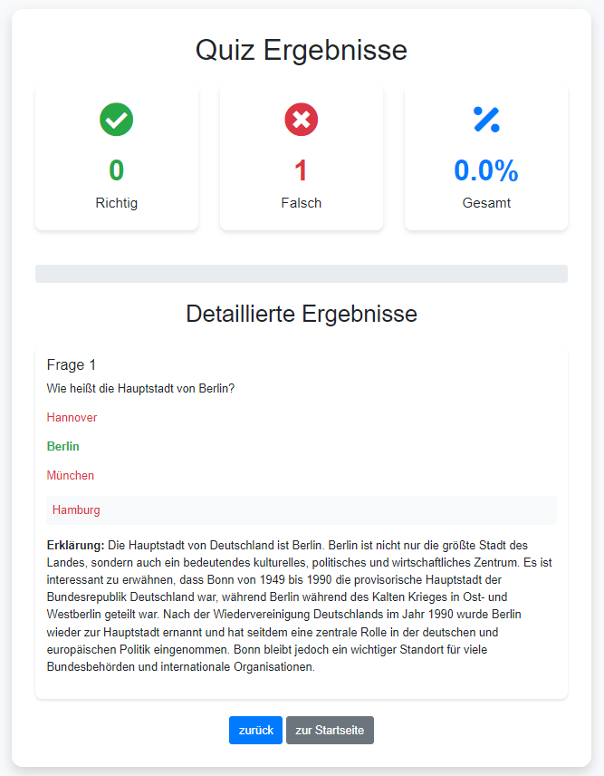
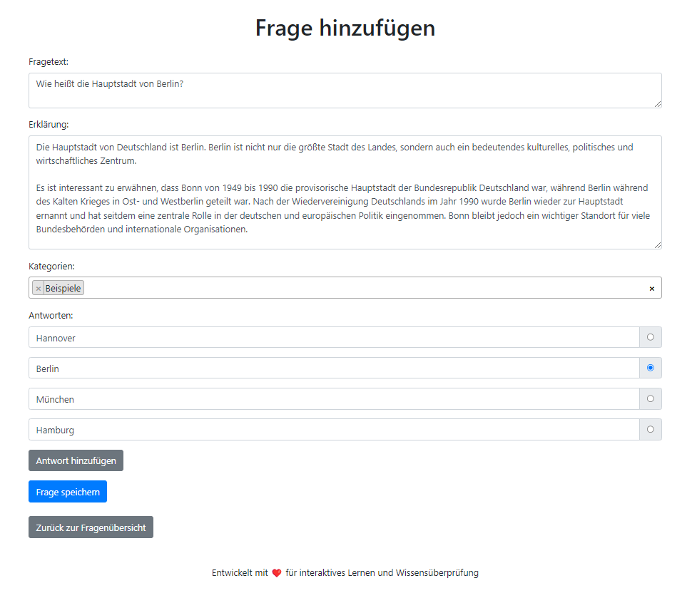
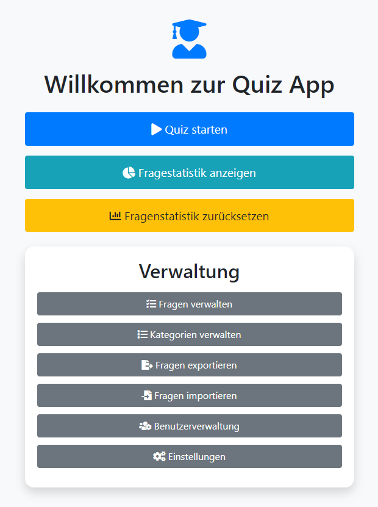

# 🧠 Quiz-App (Beta)
Eine interaktive Webanwendung zur Erstellung, Verwaltung und Durchführung von Quizzen.

⚠️ **ACHTUNG: Beta-Version** - Nicht für den produktiven Einsatz geeignet. Lesen Sie den Abschnitt "Beta-Version und Sicherheitshinweise" für wichtige Informationen.

## 🌟 Übersicht

Diese PHP-basierte Quiz-App ermöglicht es Benutzern, Quizfragen zu erstellen, zu verwalten und zu beantworten. Mit einem umfassenden Rechtemanagement und einer benutzerfreundlichen Oberfläche ist sie ideal für Bildungseinrichtungen, Unternehmen oder zum persönlichen Lernen.

## 🆕 Neueste Updates

- 🧠 **Adaptives Lernen**: Das Quiz lernt jetzt, welche Fragen der Benutzer häufiger falsch und welche richtig beantwortet hat. Es stellt die Fragen entsprechend häufiger oder weniger häufig.
- ✅ **Direktes Feedback**: Nach jeder Frage erhalten Benutzer sofort Feedback, ob ihre Antwort richtig war.
- 📊 **Verbesserte Auswertung**: In der Auswertung nach dem Quiz ist nun nicht nur die richtige Antwort erkennbar, sondern auch die selbst gewählte Antwort.
- 💾 **Datenbank-Management**: Administratoren können jetzt einen Datenbank-Dump exportieren und importieren.
- 📈 **Prozentuale Anzeige**: Benutzer sehen auf einen Blick, wie viel Prozent sie in der Fragerunde erreicht haben.
- 🐞 **Debugging-Tool**: Administratoren können die Datenbank debuggen. Die Inhalte werden mit DataTables angezeigt.
- 🎨 **UI-Verbesserungen**: Einige Ansichten wurden grafisch überarbeitet, einschließlich der Loginseite.
- 🕒 **Erweiterte Benutzerverwaltung**: Administratoren können nun den aktuellen Online-Status von Benutzern sowie deren letzte Aktivitätszeiten einsehen.
- 🧹 **Automatische Bereinigung**: Ein neues System zur regelmäßigen Bereinigung von nicht mehr benötigten Daten wurde implementiert.
- 🔄 **Datenbank-Aktualisierung**: Die Datenstruktur wurde erweitert, um neue Funktionen zu unterstützen.

## 🚀 Funktionen

- 👥 **Benutzerverwaltung**: Unterstützt verschiedene Benutzerrollen (Admin, Manager, Editor, User)
- 📝 **Fragenverwaltung**: Erstellen, Bearbeiten und Löschen von Quizfragen
- 🗂️ **Kategorisierung**: Organisieren von Fragen in verschiedene Kategorien
- 📊 **Quiz-Durchführung**: Zufällige Auswahl von Fragen aus gewählten Kategorien
- 📈 **Ergebnisauswertung**: Detaillierte Auswertung der Quiz-Ergebnisse.
- 📤 **Import/Export**: Möglichkeit zum Import und Export von Fragen im CSV-Format
- 📧 **E-Mail-Integration**: Unterstützung für Passwort-Zurücksetzung und Benachrichtigungen
- 🎨 **Responsives Design**: Benutzerfreundliche Oberfläche mit Bootstrap
- 🧠 **Adaptives Lernen**: Anpassung der Fragehäufigkeit basierend auf Benutzerleistung
- 💾 **Datenbank-Management**: Export und Import von Datenbank-Dumps
- 🐞 **Debugging-Tool**: Anzeige von Datenbankinhalten mit DataTables

## 📋 Voraussetzungen

- 🖥️ PHP 7.0 oder höher
- 🗄️ MySQL-Datenbank
- 📦 Composer (für die Installation von PHPMailer)
- 📨 SMTP-Server für den E-Mail-Versand

## 🛠️ Installation

1. Klonen Sie dieses Repository oder laden Sie die Dateien herunter.
2. Führen Sie `composer install` aus, um die erforderlichen Abhängigkeiten zu installieren.
3. Installieren Sie PHPMailer mit `composer require phpmailer/phpmailer`
4. Setzen Sie die Rechte für die `setup.php` mit `chmod 666 setup.php` und das Verzeichnis mit `chmod 755`.
5. Das Verzeichnis muss beschreibbar sein und Sie müssen Besitzer des Verzeichnisses sein.
6. Navigieren Sie im Browser zur `setup.php`, um die Ersteinrichtung durchzuführen.
7. Folgen Sie den Anweisungen zur Konfiguration der Datenbank und des E-Mail-Servers.
8. **Wichtig**: Richten Sie einen Cron-Job ein, der regelmäßig das Skript zur Datenbereinigung ausführt. Fügen Sie folgende Zeile zu Ihrer Crontab hinzu `*/5 * * * * php /pfad/zu/ihrer/app/lib/scripts/cleanup_sessions.php`

## ⚙️ Konfiguration

Die `setup.php` führt Sie durch den Konfigurationsprozess:

1. 🗄️ **Datenbankeinstellungen**: Host, Name, Benutzer, Passwort
2. 📧 **E-Mail-Server-Einstellungen**: SMTP-Host, Port, Benutzer, Passwort, Absender
3. 👤 **Admin-Benutzer erstellen**: Benutzername, E-Mail, Passwort

Nach Abschluss des Setups wird eine `config.php` erstellt. Die `setup.php` sollte aus Sicherheitsgründen gelöscht werden.

## 🚀 Verwendung

1. Melden Sie sich mit Ihren Admin-Zugangsdaten an.
2. Verwenden Sie das Dashboard zur Navigation durch die verschiedenen Funktionen:
   - 📝 Fragen erstellen und verwalten
   - 🗂️ Kategorien verwalten
   - 👥 Benutzer verwalten
   - 🧠 Quiz durchführen
   - 📊 Ergebnisse anzeigen

## 🖼️ Screenshots

Hier sind einige Screenshots der Anwendung:

### Beispiel einer Quizfrage mit direktem Feedback

### Beispiel einer Auswertung einer Fragerunde

### Beispiel einer User-Statistik

### Einfache Eingabe einer Frage

### Hauptmenü

## 🛠️ Anpassung

Sie können die App weiter anpassen, indem Sie:

- 🎨 Das Design durch Änderung der CSS-Dateien anpassen
- 🌐 Weitere Sprachen hinzufügen
- ➕ Zusätzliche Funktionen wie Statistiken oder Leaderboards implementieren

## ⚠️ Vorsicht

- Sichern Sie Ihre Datenbank regelmäßig.
- Halten Sie alle Abhängigkeiten aktuell.
- Überprüfen Sie die Sicherheitseinstellungen Ihres Servers.
- Die Software befindet sich noch in der Entwicklungsphase, Scripte werden noch extern bezogen und wurden noch keine Sicherheitsüberprüfungen in Bezug auf SQL-Injection  und Datensicherheit vorgenommen.

## 🆘 Unterstützung

Bei Problemen, Fragen oder Beiträgen öffnen Sie bitte ein Issue in diesem GitHub-Repository.

## 📄 Lizenz

Dieses Projekt steht unter der MIT-Lizenz. Weitere Details finden Sie in der [LICENSE](LICENSE) Datei.

## ⚠️ Beta-Version und Sicherheitshinweise

**Wichtiger Hinweis:** Diese Software befindet sich derzeit in einer Beta-Phase und ist nicht für den produktiven Einsatz vorgesehen.

- 🚧 Die Anwendung ist noch in aktiver Entwicklung und kann Fehler oder unvollständige Funktionen enthalten.
- 🔒 Es wurden bisher keine umfassenden Sicherheitsüberprüfungen durchgeführt. Die Anwendung kann Schwachstellen in Bezug auf IT-Sicherheit aufweisen.
- ⚖️ Die rechtliche Konformität, insbesondere im Hinblick auf Datenschutz und DSGVO, wurde noch nicht vollständig geprüft und sichergestellt.
- 🌐 Einige Skripte und Ressourcen werden von externen Quellen bezogen, was zusätzliche Sicherheitsrisiken bergen kann.

Wir empfehlen dringend:
- Verwenden Sie diese Software nicht für sensible oder personenbezogene Daten.
- Setzen Sie die Anwendung nur in einer kontrollierten, nicht-öffentlichen Umgebung ein.
- Führen Sie vor einem produktiven Einsatz eine gründliche Sicherheitsüberprüfung durch.
- Konsultieren Sie Experten für IT-Sicherheit und Datenschutz, bevor Sie die Anwendung in einer Produktivumgebung einsetzen.

Die Entwickler übernehmen keine Haftung für Schäden oder rechtliche Konsequenzen, die aus der Nutzung dieser Beta-Version entstehen können.

---

Entwickelt mit ❤️ für interaktives Lernen und Wissensüberprüfung
